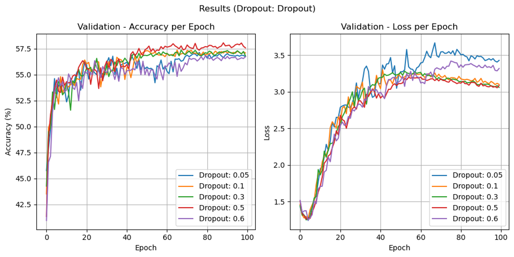
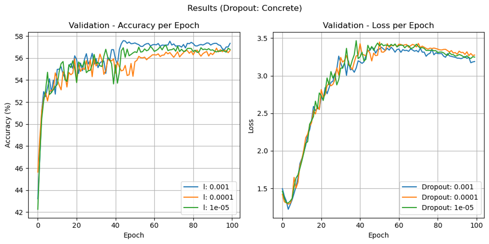

## Overview
The goal of this project is to examine how various regularization methods affect the performance of deep neural networks. 
Specifically, we investigate the impact of different dropout techniques on the performance of emotion classification using the FER-13 dataset with a ResNet-18 architecture.

## Motivation
Overfitting is a common challenge in deep learning, where models perform well on training data but poorly on unseen data. This occurs when a model learns noise and details specific to the training set rather than general patterns. Dropout techniques help mitigate overfitting by randomly deactivating neurons during training, encouraging models to learn more robust features. This project compares various dropout methods to identify the most effective strategy for enhancing model generalization and performance.

## Methodology
1- Each dropout method was tested with various parameters on the **validation set** to identify the best-performing configuration.  
2- The best parameters were then used to evaluate performance on the **test set**.

## Dataset
We use the FER13 dataset, which contains grayscale images classified into seven distinct emotions. 

# Files in this repository

File Name   | Purpose
------------- | -------------
emotions_detector.ipynb  | Main notebook to run and visualize experiments.
utils.py  | Contains utility functions for data processing, training and evaluation, results visualization, and output saving.
resnet_model.py  | Implements the base ResNet-18 architecture used across all experiments.
drops_methods/resnet_dropout.py | Implements the ResNet-18 model with standard dropout layers.
drops_methods/resnet_concrete.py | 	Implements the ResNet-18 model with Concrete Dropout layers.
drops_methods/resnet_variational.py | Implements the ResNet-18 model with Variational Dropout layers.
drops_methods/resnet_dropblock.py | Implements the ResNet-18 model with DropBlock layers.
drops_methods/resnet_shakedrop.py | Implements the ResNet-18 model with ShakeDrop layers.
checkpoints | Directory that stores model checkpoints during training.
results | Directory that contains JSON files with experiment results for different dropout methods and parameters on the validation set.
best_results | Directory that contains JSON files with the best results and parameters for each dropout method on the test set.

## Results

Regular Dropout:

Variational Dropout:

Concrete Dropout:

Shake-Drop:

Drop Block:

## References
[1] FER-2013 Dataset: https://www.kaggle.com/datasets/msambare/fer2013  
[2] Yarin Gal, Jiri Hron, Alex Kendall. "Concrete Dropout" arxiv.org/pdf/1705.07832  
    [Torch Implementation https://github.com/danielkelshaw/ConcreteDropout]  
[3] Diederik P. Kingma, Tim Salimans, Max Welling "Variational Dropout and the Local Reparameterization Trick" arxiv.org/pdf/1506.02557  
    [https://github.com/elliothe/Variational_dropout]  
[4] Golnaz Ghiasi, Tsung-Yi Lin, Quoc V. Le. "DropBlock: A regularization method for convolutional networks" arxiv.org/pdf/1810.12890  
    [Torch Implementation https://github.com/miguelvr/dropblock]  
[5] Yoshihiro Yamada, Masakazu Iwamura, Takuya Akiba, Koichi Kise. "ShakeDrop Regularization for Deep Residual Learning" arXiv:1802.02375v2  
    [Torch Implementation https://github.com/imenurok/ShakeDrop]  
