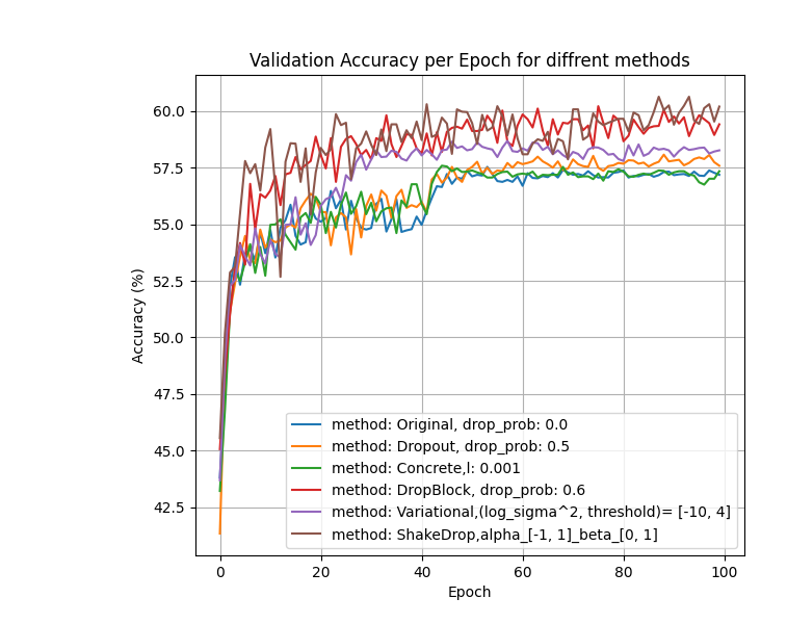

# Overview
The goal of this project is to examine how various regularization methods affect the performance of deep neural networks. 
Specifically, we investigate the impact of different dropout techniques on the performance of emotion classification using the FER-13 dataset with a ResNet-18 architecture.

# Motivation
Overfitting is a common challenge in deep learning, where models perform well on training data but poorly on unseen data. This occurs when a model learns noise and details specific to the training set rather than general patterns. Dropout techniques help mitigate overfitting by randomly deactivating neurons during training, encouraging models to learn more robust features. This project compares various dropout methods to identify the most effective strategy for enhancing model generalization and performance.

# Methodology
## Architecture
We used ResNet18 as the base model for our experiments. ResNet18 is a convolutional neural network (CNN) from the ResNet (Residual Network) family, specifically designed to mitigate the vanishing gradient problem in deep networks. Building upon this architecture, we implemented various dropout methods to evaluate their effectiveness.

## Dataset
We use the FER13 dataset, which contains grayscale images classified into seven distinct emotions. 


## Hyper Parameters
During our experiments we kept the standard hyper parameters constant with the following values:
parameter   | Value
------------- | -------------
criterion  |  Cross Entropy
optimizer  |  SGD
momentum   |  0.9
Batch size  |  64
Epochs   |  100
Learning rate  |  0.005

However, for each of the dropout methods we examined a set of its hyper parameters and chose those which received the best results.


# Files in this repository

File Name   | Purpose
------------- | -------------
emotions_detector.ipynb  | Main notebook to run and visualize experiments.
utils.py  | Contains utility functions for data processing, training and evaluation, results visualization, and output saving.
dropout_methods/resnet_model.py  | Implements the base ResNet-18 architecture used across all experiments.
dropout_methods/resnet_dropout.py | Implements the ResNet-18 model with standard dropout layers.
dropout_methods/resnet_concrete.py | 	Implements the ResNet-18 model with Concrete Dropout layers.
dropout_methods/resnet_variational.py | Implements the ResNet-18 model with Variational Dropout layers.
dropout_methods/resnet_dropblock.py | Implements the ResNet-18 model with DropBlock layers.
dropout_methods/resnet_shakedrop.py | Implements the ResNet-18 model with ShakeDrop layers.
checkpoints | Directory that stores model checkpoints during training.
results | Directory that contains JSON files with experiment results for different dropout methods and parameters on the validation set.
images | Directory that contains all the images that used in the project.

# How to run this code
To run this code, follow these steps:

1. Clone the Repository
```
git clone https://github.com/AdiBruchian/what-is-your-Inside-Out-emotion.git
cd what-is-your-Inside-Out-emotion
```

2. Install required packages
```
pip install -r requirements.txt
```

3. Download the Dataset  
Download the FER-2013 dataset from  https://www.kaggle.com/datasets/msambare/fer2013 and place it in "dataset" directory. 

4. Run the notebook "emotions_detector.ipynb"


 

# Results
## Validation
We evaluated each dropout method with various parameters on the validation set to identify the optimal settings for the task. The method that yielded the best results was ShakeDrop, demonstrating a 3.16% improvement compared to the model without any regularization.

The full results are in the "results" folder.

## Test
We selected the top-performing model from each dropout method and assessed their performance on the test set. 
Although ShakeDrop performed the best on the validation set, DropBlock outperformed it on the test set.
 
Method   | Test Loss   | Test Accuracy
------------- | ------------- | -------------
Original ResNet18  |  3.184  |  58.15%
Dropout  |  3.034  |  58.21%
Variational   |  1.835  |  58.78%
Concrete  |  3.084  |  58.58%
DropBlock   |  1.841  |  60.43%
ShakeDrop  |  1.562  |  60.35%

## Examining Generalization on our images
Finally, we examined the generalization of our model, which was trained using the DropBlock regularization on our images. 
Some images received "correct" label, and some of them did not:

This is a result we expected in advance due to the model's mediocre performance on the validation and test sets.

# Conclusion
ShakeDrop and DropBlock both enhanced generalization, with DropBlock achieving the highest test accuracy. DropBlock’s effectiveness lies in its ability to drop contiguous feature map regions, forcing the network to rely on different image areas and improving robustness by making the network recognize objects even when parts are missing.

Future work could explore varying architectures, regularization methods, and hyperparameters to further improve generalization.

# References
[1] FER-2013 Dataset: https://www.kaggle.com/datasets/msambare/fer2013  
[2] Yarin Gal, Jiri Hron, Alex Kendall. "Concrete Dropout" arxiv.org/pdf/1705.07832  
    [Torch Implementation https://github.com/danielkelshaw/ConcreteDropout]  
[3] Diederik P. Kingma, Tim Salimans, Max Welling "Variational Dropout and the Local Reparameterization Trick" arxiv.org/pdf/1506.02557  
    [https://github.com/elliothe/Variational_dropout]  
[4] Golnaz Ghiasi, Tsung-Yi Lin, Quoc V. Le. "DropBlock: A regularization method for convolutional networks" arxiv.org/pdf/1810.12890  
    [Torch Implementation https://github.com/miguelvr/dropblock]  
[5] Yoshihiro Yamada, Masakazu Iwamura, Takuya Akiba, Koichi Kise. "ShakeDrop Regularization for Deep Residual Learning" arXiv:1802.02375v2  
    [Torch Implementation https://github.com/imenurok/ShakeDrop]  
